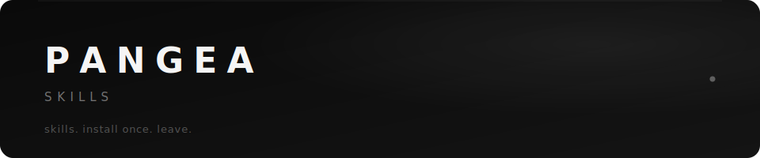

<p align="center">
  
</p>

<p align="center">
  
  
  
  
</p>

<p align="center"><b>Shared skills for Claude Code.</b> Drop in. Build better.</p>

---

### Install

```bash
curl -fsSL https://raw.githubusercontent.com/sisiphamus/pangea-skills/main/install.sh | bash
```

New session → **“use the ui skill”**

<details>
<summary>one skill only · clone · paste mode</summary>

```bash
# just ui
curl -fsSL https://raw.githubusercontent.com/sisiphamus/pangea-skills/main/install.sh | bash -s -- ui

# clone
git clone https://github.com/sisiphamus/pangea-skills.git && cd pangea-skills && ./install.sh
```

**Claude.ai:** open [`skills/ui/SKILL.md`](./skills/ui/SKILL.md) → paste into chat.

</details>

---

### Lands

| | Skill | What |
|:--:|:------|:-----|
| 🎨 | **[ui](./skills/ui/SKILL.md)** | Frontend craft — type, color, layout, anti-slop |

---

<p align="center">
  <sub>craft was always one plate · <a href="https://github.com/sisiphamus/pangea-skills">sisiphamus/pangea-skills</a></sub>
</p>
